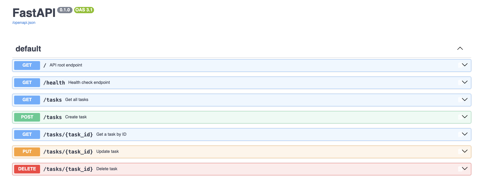

# FlyRank Week 2 Task: Building your first CRUD API

An in-memory CRUD API for managing tasks, built with FastAPI and Python.

## Getting Started
### 1. Installation
To get started, clone the repository and set up your virtual environment:

```bash
git clone https://github.com/judezy/flyrank-building-api.git
cd flyrank-building-api
python3 -m venv venv
source venv/bin/activate # or if you are using windows: venv\Scripts\activate
pip install "fastapi[standard]"
```

### 2. Running the Server
Start the API server on `http://localhost:8000`:

```bash
fastapi dev main.py
```

You can find interactive API documentation at `http://localhost:8000/docs`


--- 

## API Endpoints


---

## Sample Curl Output
### Create Task (`POST /tasks`)

```bash
curl -i -X POST http://localhost:8000/tasks \
-H "Content-Type: application/json" \
-d '{"title": "Buy milk"}'
```

```http
HTTP/1.1 201 Created
date: Wed, 19 Aug 2026 19:12:04 GMT
server: uvicorn
content-length: 40
content-type: application/json

{"id":5,"title":"Buy milk","done":false}
```

---